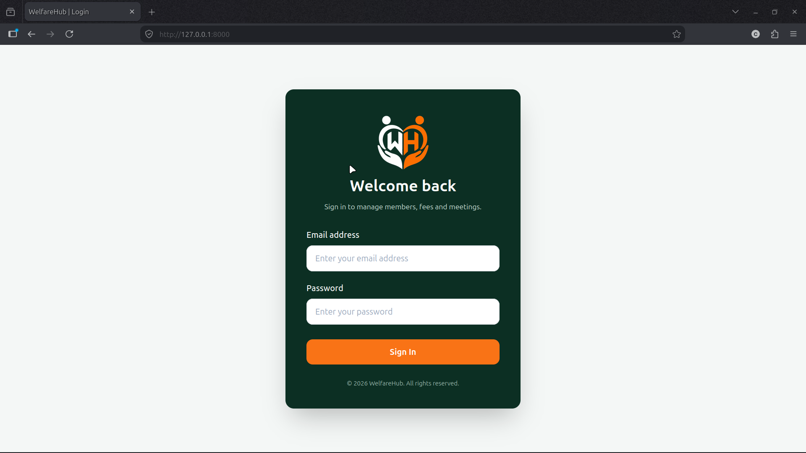
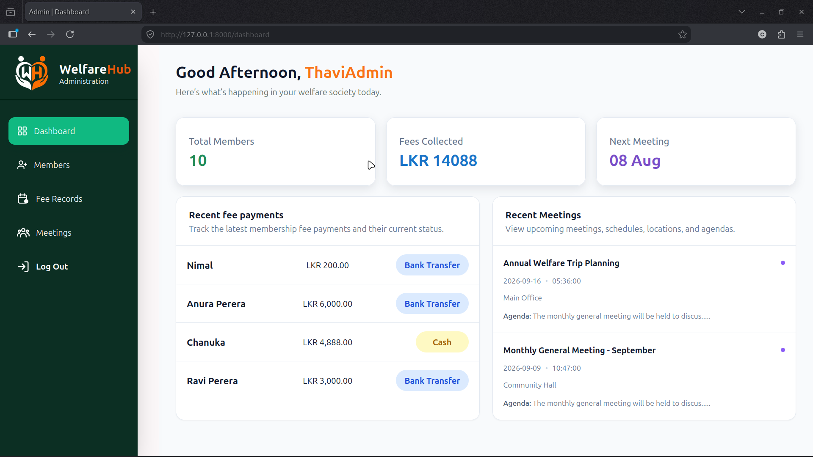
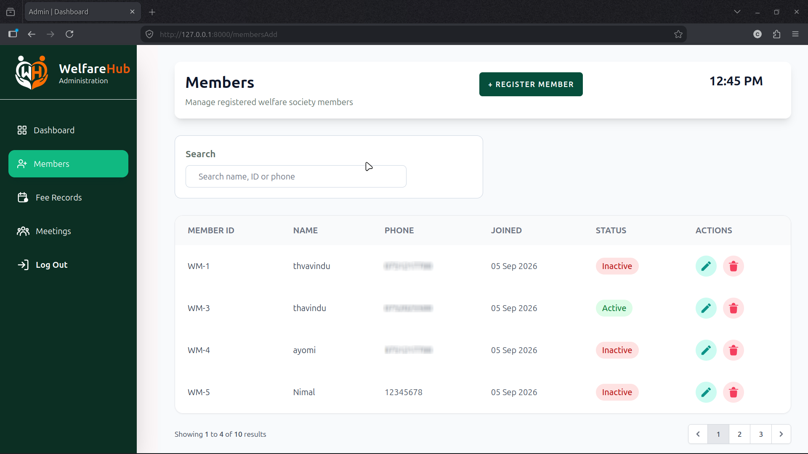
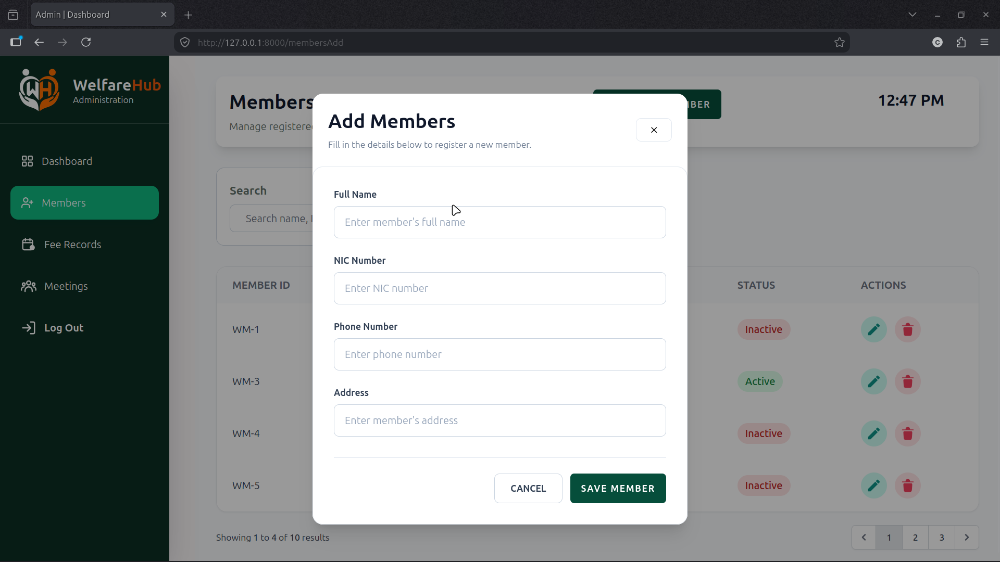
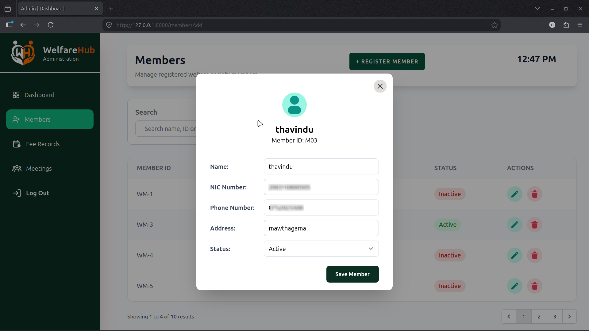
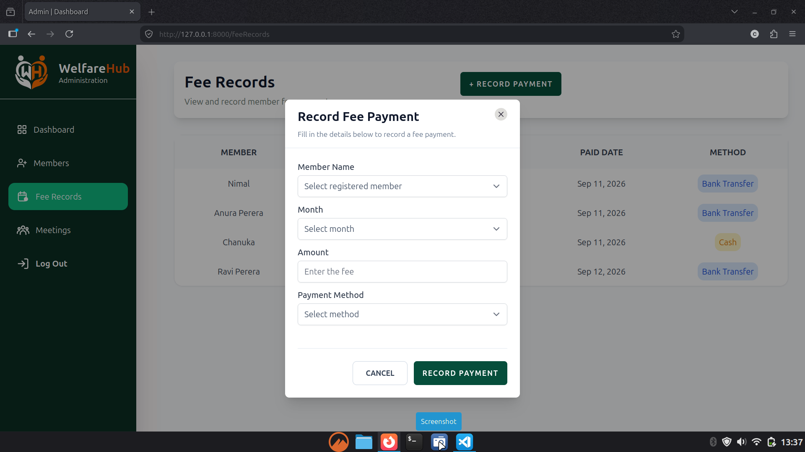
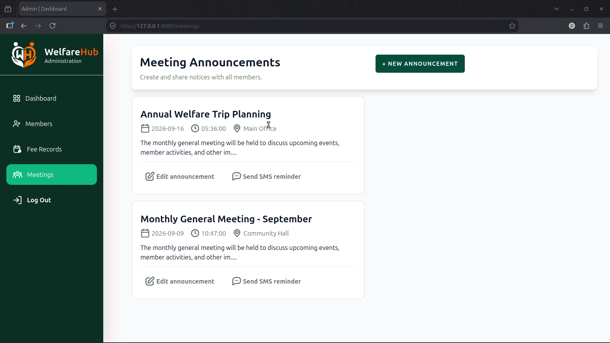
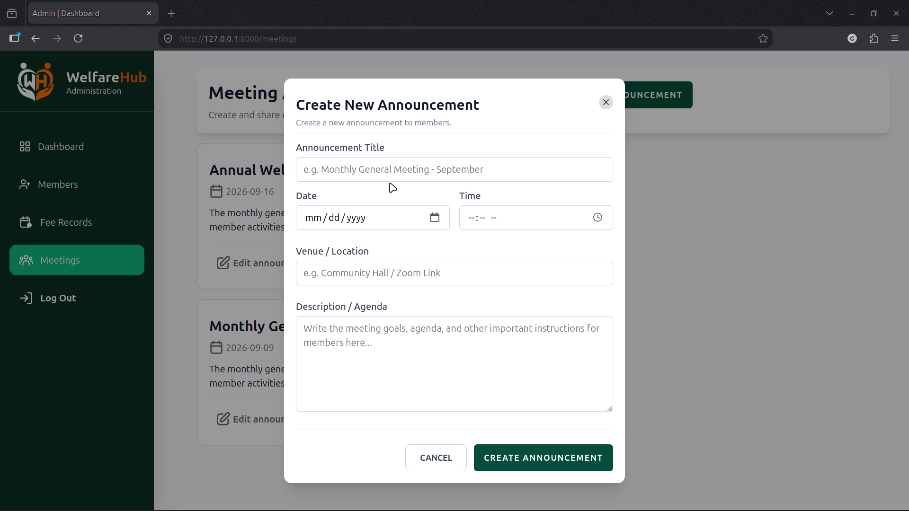
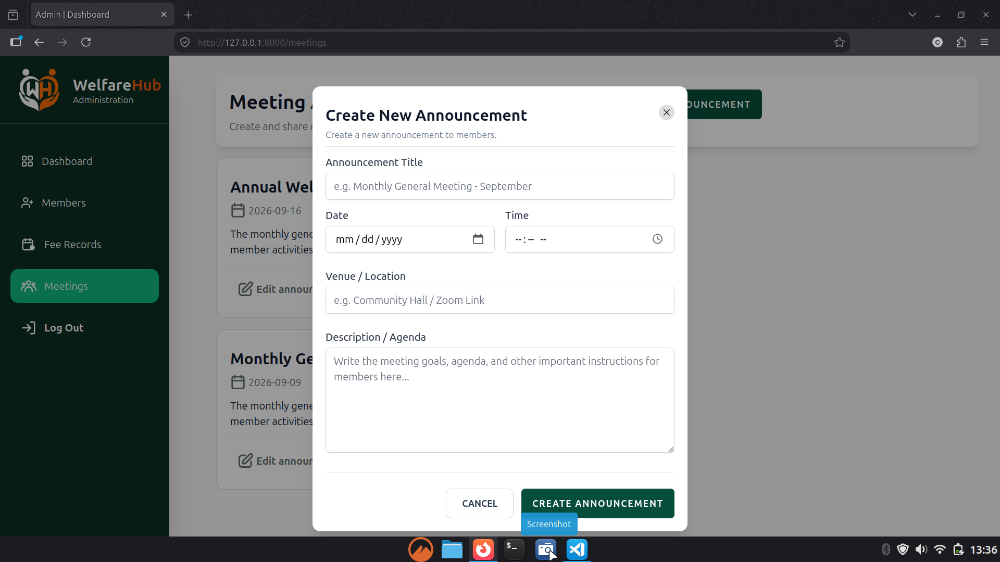

# WelfareHub

WelfareHub is an admin-based Laravel CRUD application developed to manage welfare society activities.

## Features

- Member Management
- Fee Record Management
- Meeting Management
- Announcements
- SMS Meeting Reminders using Text.lk
- Active / Inactive Member Management
- Admin Dashboard

## Technologies Used

- Laravel
- PHP
- MySQL
- Tailwind CSS
- JavaScript
- Blade
- Text.lk SMS API

## Screenshots

### WelfareHub | Login



### Dashboard



### Members



### Add Member



### Edit Member



### Fee Records


### Record Fee



### Meetings



### Create Meeting



### Edit Meeting



## Installation

Clone the repository:

```bash
git clone https://github.com/thavinduharshana53-commits/WelfareHub.git
```
